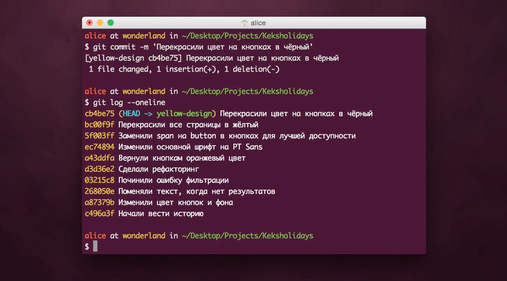

---
tag:
- Git
- Git/Консоль
---
## История коммитов
Сначала вспомним, что такое коммит. Коммит — это сохранение текущего состояния проекта. Каждый коммит — это отдельная версия проекта, которая сохраняется и добавляется в хранилище.

Посмотрим, как Git хранит коммиты. Вся история хранится файлами в папке .git. Если вы знаете хэш (уникальный идентификатор) коммита, можете найти его в этой папке. Давайте посмотрим лог, чтобы выбрать какой-нибудь коммит.

```shell
git log --oneline
```


Параметр onelineвыводит каждый коммит в одну строку, а не в пять, как обычно. Например, возьмём последний коммит. Команда cat-fileпокажет содержимое этого коммита. Параметр -pвыводит данные в человекочитаемом виде. После -pидёт хэш коммита.

```shell
git cat-file -p hash
```


В каждом коммите есть:

-   tree — состояние файла на момент коммита;
-   parent — хэш родительского, то есть предыдущего, коммита;
-   автор коммита и время, когда коммит был создан;
-   commiter — человек, который сделал коммит, и время, когда он его сделал;
-   и на последней строке commit message — описание коммита.

Обычно человек, который сделал коммит, и автор совпадают, но это могут быть и разные люди, например, если один разработчик изменил коммит другого. То есть коммит хранит не только состояние, но и кто, когда и почему его сохранил. И ещё знает предыдущий коммит. Поэтому можно посмотреть историю, ведь каждый коммит знает, какой коммит был предыдущим.

Давайте посмотрим как выглядит самый первый коммит.


У этого коммита нет родительского, ведь он был первым.
Представим коммиты в виде кружков. Допустим, у нас есть три коммита. Коммит держится лапкой за своего родителя: третий коммит держится за второй, второй коммит держится за первый. Первый ни за кого не держится, у него нет родителя. При этом, если у нас три коммита, то мы находимся в последнем. Обозначим его Кексом.


Когда мы фиксируем состояние, создаётся новый коммит и мы перемещаемся в него. Предыдущие коммиты остаются позади.


Мы можем переместиться в состояния этих коммитов, например, попасть во второй коммит. Это можно сделать при помощи команды `git checkout` — она переключает состояния файла. Если этой команде передать хэш коммита, она переместит нас в этот коммит. То есть, все файлы в нашем проекте будут выглядеть так, как в этом коммите.

Давайте выберем какой-нибудь коммит и переключимся в него. Смотрим `git log`, чтобы выбрать коммит и переключаемся. Посмотрим историю — мы видим историю только до этого коммита.


Это не значит, что все последующие коммиты исчезли, просто история всегда показывается до текущего коммита.

Давайте вернёмся к последнему коммиту. Убедимся, что мы и правда в последнем коммите и наша история не потерялась. Посмотрим `git log`.


Коммиты на месте, мы в последнем, всё в порядке. Но как бы мы вернулись к этому коммиту, если потеряли бы его хэш?

К последнему коммиту всегда легко вернуться. Git хранит ссылку, или указатель, на последний коммит — некоторое слово, которое вы можете запомнить вместо хэша коммита. По умолчанию это кодовое слово — master. Когда вы делаете новый коммит, этот указатель шагает вместе с вами и начинает показывать на новый коммит.


Указатели можно создавать. На любой коммит можно создать указатель. Например, на позапрошлый коммит, в котором мы перекрасили страницу в жёлтый. Команда git checkoutможет не только переместить нас, но и вместе с тем создать указатель.


Найдём хэш коммита, где мы сделали страницы жёлтыми. Переключимся в него, вместе с тем создав указатель.

```shell
git checkout -b yellow-design bc00f9f
```

-   yellow-design — это имя указателя (или ветки);
-   bc00f9f — хэш коммита.

Посмотрим `git status`.


Смотрите, здесь написано «On branch yellow-design», а до этого всегда было написано «On branch master». Всё дело в том, что мы находимся в точке с указателем yellow-design.

Давайте посмотрим лог.


Рядом с коммитом название указателя — yellow-design, значит он указывает на этот коммит.

Можно посмотреть git log не только для текущего места, но и вообще всего.

```shell
git log --oneline --all
```


Видно, что есть указатель masterи указатель yellow-design. Как понять, где мы?

Слово HEAD указывает на текущее положение, в данном случае — yellow-design. Мы можем всегда находиться только в одном состоянии, поэтому HEADвсегда один. А именованных указателей на коммиты может быть много.

Раньше, когда мы использовали указатель master, мы создавали коммит и указатель перемещался на новый коммит. Сейчас после текущего коммита есть другие. Что будет, если мы попробуем что-то изменить и закоммитить?

Вносим изменение в файл, индексируем и создаём коммит. Посмотрим лог.



За коммитом, где мы только что были, следует новый коммит. А те коммиты, которые раньше шли после нашего, исчезли. Давайте посмотрим полную историю коммитов.

```shell
git log --oneline --all --graph
```


Мы добавили флаг graph, который не просто выводит историю в столбик, а рисует схему. Видно, что остались и те коммиты, которые были сделаны раньше (про уменьшение шрифта на кнопках и шрифта телефона), и новый коммит тоже есть. История как бы раздвоилась.

Давайте посмотрим на схеме. Сначала мы создали новый указатель коммита, в котором страницы стали жёлтыми и переместились туда. Потом мы создали новый коммит. Как мы уже выяснили, при создании коммита, мы переходим в этот новый коммит и указатель переходит вместе с нами.


Получается, что история разошлась. После этого коммита получилось две версии развития событий: в одной мы меняли размеры шрифтов, а в другой — цвет на кнопках.

Такое разделение истории называется ветвлением. А указатели masterи yellow-designназываются ветками. Точнее, веткой обычной называют ещё и всю историю коммитов, приводящую в текущую точку — то, что мы видим в логе.

То есть, когда говорят «ветка master», имеют в виду вот эти коммиты:


А «ветка yellow-design» — это вот эти коммиты:


Хорошо, технически с ветками разобрались. А когда всё-таки создавать новую ветку?

## Ветвление
Представим, что мы запустили первую версию своего проекта по поиску няни для кота на время отпуска: там можно зарегистрироваться, загрузить фотографию себя и кота, указать дату отпуска. Но на сайте пока нельзя связаться с другими владельцами котов, чтобы оставить своего кота, мы над этой функцией ещё работаем.

Мы сделали несколько коммитов для новой страницы: описали стили и скрипты, страница ещё в работе. И тут нам пишет пользователь о том, что на сайте ошибка. У пользователя кота зовут Котстантин Котстантинович Котстантинопольский, и вёрстка от этого имени разваливается.

Мы хотим починить ошибку, но при этом не хотим опубликовать незаконченную страницу. Что делать?

Чтобы избежать таких проблем, используют ветки. Ветки — это когда в некоторой точке история разделилась. Например, в этой реальности вы продолжите смотреть видео, а в параллельной пойдёте на пробежку. Не знаем, можно ли так в жизни, но в Git — можно.

Ветвление — самая соль Git. Ветки позволяют разным людям или даже десяткам людей работать над проектом параллельно — каждый в своей ветке реальности.

В каждом репозитории есть как минимум одна ветка. Это основная ветка, которую создаёт сам Git, она называется master. Обычно в ней находится стабильная версия программы без ошибок. Если вы хотите исправить баг, добавить новую функциональность в проект, попробовать какую-то технологию, но не хотите сломать код в основной ветке, вы ответвляетесь из master и трудитесь в своей новой ветке. Здесь вы можете реализовывать свои идеи, не переживая, что рабочий код сломается.

Когда задача сделана, рабочая ветка вливается в основную — master. Каждая ветка — что-то вроде второстепенной дороги, которая затем снова соединяется с основной.

На курсах мы как раз будем использовать такую стратегию. Для каждого задания вы будете создавать ветку и работать в ней. Потом наставник проверит ваше задание и вольёт ветку в master.

Выше мы создавали ветку yellow-designиз коммита в прошлом. Так же легко можно создать ветку из текущего коммита — просто не указывать хэш.

Создадим новую ветку. Открываем терминал, вводим команду git branch — она показывает список веток, с которыми мы работаем в проекте, и выделяет текущую. Если мы находимся в master, создаём новую ветку при помощи уже известной нам команды git checkout.

```shell
git checkout -b имя-новой-ветки
```

Если текущая ветка не master, то сначала нужно переключиться в основную ветку и создать новую ветку именно из неё. Мы делаем это, чтобы новая ветка содержала свежую, на момент создания, рабочую версию проекта.

Переключиться на ветку masterможно при помощи всё той же команды git checkout — она позволяет переключаться между существующими ветками в проекте. После git checkout надо указать название нужной ветки. Выполнив git checkout master, мы перейдём в ветку master.

Если вы ошиблись в названии ветки, которую создали, например, допустили опечатку, вы можете изменить название ветки с помощью команды: git branch -m старое-имя-ветки новое-имя-ветки.

Когда ветка создана и её имя в порядке, можно наконец-то приступать к работе над проектом.
